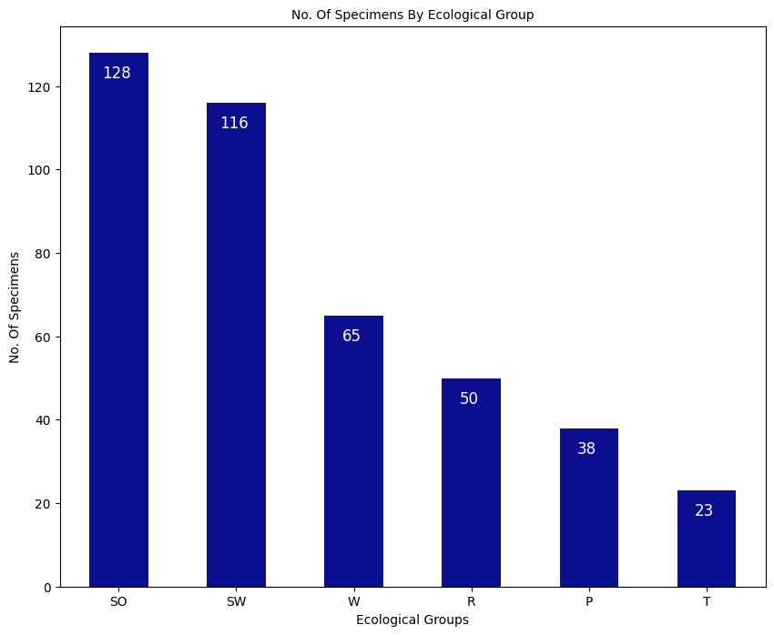
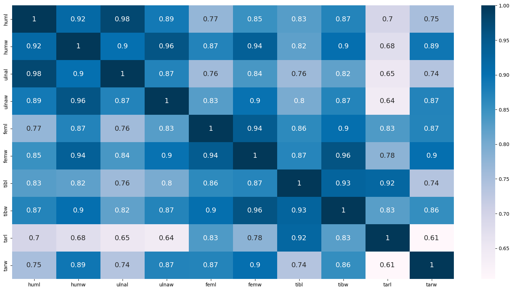

# Birds Bones Classification

## Project Overview
This project aims to classify birds into six ecological categories based on their bone measurements using machine learning models. The dataset consists of 420 bird specimens, each belonging to one of the following categories:

- Swimming Birds (SW)  
- Wading Birds (W)  
- Terrestrial Birds (T)  
- Raptors (R)  
- Scansorial Birds (P)  
- Singing Birds (SO)

<p>Below is a plot showing the number of Specimens by Ecological Groups:</p>

<p align="center">
  
</p>


## Dataset Description
The dataset includes 10 continuous measurements (in millimeters) of various bird bones :  
- huml: Length of the humerus
- humw: Diameter of the humerus
- ulnal: Length of the ulna
- ulnaw: Diameter of the ulna
- feml: Length of the femur
- femw: Diameter of the femur
- tibl: Length of the tibiotarsus
- tibw: Diameter of the tibiotarsus
- tarl: Length of the tarsometatarsus
- tarw: Diameter of the tarsometatarsus

## Data Preprocessing

**1. Handling Missing Values:** The dataset had missing values in several columns. These were filled with the mean of the respective columns.  

**2. Feature Correlation:** A correlation matrix revealed high correlations between some features, particularly between ulnal and huml. To avoid redundancy, we dropped the following highly correlated features: ulnal, ulnaw, and tibw.  

<p>Below is a plot showing the correlation matrix heatmap :</p>

<p align="center">
  
</p>

**3. Outlier Detection and Removal:** Outliers were identified using the Interquartile Range (IQR) method and were removed to improve model performance.  

**4. Data Scaling:** The data was scaled using the MinMaxScaler to normalize the features.  

**5. Class Imbalance Handling:** The SMOTE (Synthetic Minority Over-sampling Technique) algorithm was used to balance the dataset, ensuring that the training data was evenly distributed across all classes.  

## Downloading the Dataset

The dataset for this project is not included in this repository. You can download it from the following source:  

[Birds' Bones and Living Habits Dataset](https://www.kaggle.com/datasets/zhangjuefei/birds-bones-and-living-habits).  

After downloading the dataset:  

**1. Extract the Dataset:**  

Once the ZIP file is downloaded, extract it into your working directory. For example, if you're working in a local environment or a cloud-based environment like Google Colab, make sure to extract the files to a directory accessible by your code.  

**2. Path Configuration:**  

Ensure that the extracted files are accessible in the specified directory. You might need to adjust the file paths in your code if your setup differs. For example, if your dataset is extracted into a directory called data, the path configuration in your code should reflect this structure.  
In the provided notebook, the file path for the CSV file containing the bird bones measurements is:

```sh
'/kaggle/input/birds-bones-and-living-habits/bird.csv' 
```
Make sure to update the path in your code or notebook as needed.  

## Installation and Requirements
To run this project on your local machine, you will need to install the following dependencies:

- Python 3.7+
- Jupyter Notebook
- Scikit-learn
- Pandas
- NumPy
- Matplotlib

You can install the required packages using the following commands:

```sh
pip install -r requirements.txt
```
Alternatively, you can create a virtual environment and install the dependencies:
```sh
python -m venv env
source env/bin/activate  # On Windows, use env\Scripts\activate   
pip install -r requirements.txt
```

## Model Files

The trained models are saved in the `Models` folder. You can use these models for inference or further fine-tuning. The model files are named as follows:  

- knn_model.pkl  
- random_forest_model.pkl  
- decision_tree_model.pkl  
- gradient_boosting_model.pkl  
- svm_model.pkl

To load a model, use the following code snippet:  

```python
import joblib

# Example for loading the KNN model
model = joblib.load('Models/knn_model.pkl')
```

## Usage
**1. Data Preprocessing:** The provided Jupyter notebook includes steps for loading and preprocessing the Birds' Bones and Living Habits Dataset. This involves handling missing values, scaling features, and addressing data imbalance.

**2. Model Training:** The notebook demonstrates how to define, train, and evaluate various machine learning models, including K-Nearest Neighbors, Random Forest, Decision Tree, Gradient Boosting, and Support Vector Machine.

**3. Model Evaluation:** The performance of each model is evaluated using metrics such as accuracy, log loss, and AUC score. The notebook includes visualizations of the results with inferencing on unseen data and a summary of the models performances.
In summary, the `Support Vector Machine` emerges as `the best-performing model overall` for this project, with a combination of high accuracy, low log loss, and the highest AUC score. The K-Nearest Neighbors model is also strong but could benefit from improved prediction confidence. Random Forest and Gradient Boosting offer competitive performances, while the Decision Tree, although simpler, lags behind in accuracy and confidence.

**4. Inference:** You can use the trained models to classify new bird bone measurement data by running the inference section of the notebook.

## Authors

Rayane Mehires - rayanemehires@gmail.com

Project Link: [GitHub - Birds Bones Classification](https://github.com/MRayane/Birds-Bones-Classification/tree/main).

## Thank you
  
